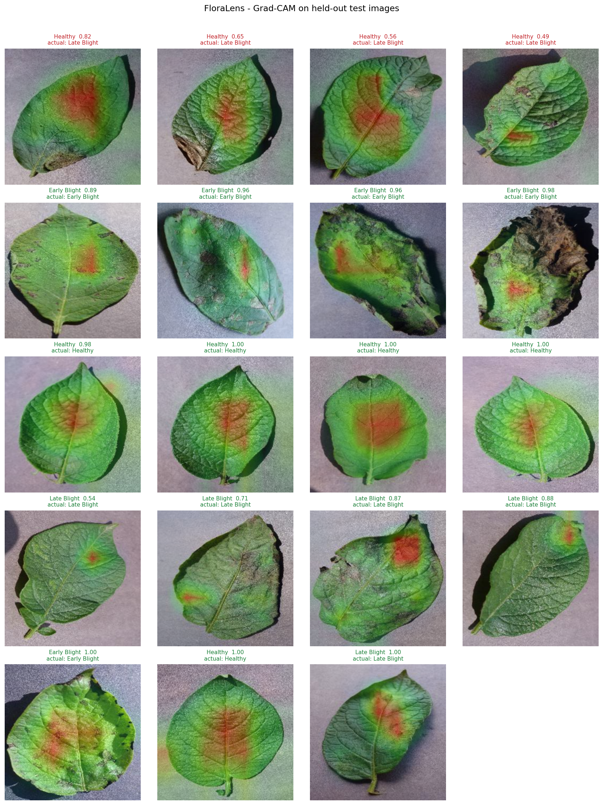
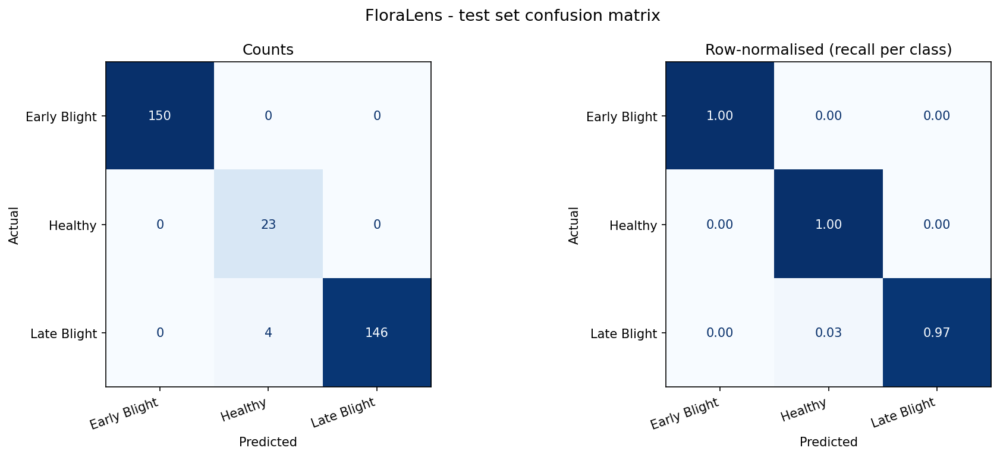
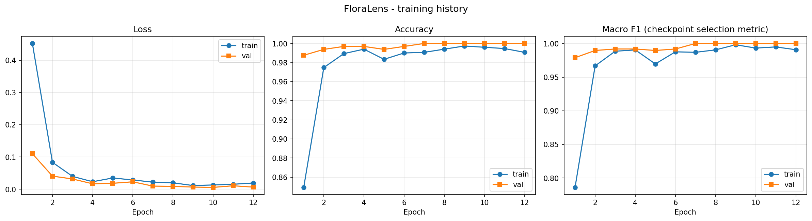

# FloraLens — Plant Disease Detection with Grad-CAM

Potato leaf disease classification that shows which part of the leaf it based the
answer on. Built for the B.Y.T.E. / Arithmatrix **AVIP 2026** AI/ML track, Task 4
("The X-Ray Vision").

**Live demo:** _(added below once deployed)_

| | |
|---|---|
| Task | 3-class image classification: early blight, late blight, healthy |
| Data | PlantVillage potato subset, 2,152 images |
| Model | MobileNetV3-Small, ImageNet-pretrained, fine-tuned |
| Test accuracy | **98.76%** (323 held-out images) |
| Macro F1 | **0.9688** |
| Explanation | Grad-CAM, verified against a reference implementation |
| Demo | Runs entirely in the browser, no server |



---

## Summary

FloraLens classifies a potato leaf as early blight, late blight, or healthy, and
produces a Grad-CAM heatmap showing which regions of the image drove that
decision. It reaches 98.76% accuracy and 0.9688 macro F1 on 323 held-out images.

The interesting part is not the accuracy — PlantVillage is a clean, uniformly
photographed dataset and high numbers are expected on it — but what the heatmaps
show. Every one of the four test errors runs the same direction: a late blight
leaf called healthy. Looking at their Grad-CAM maps, the model concentrated on
clean tissue in the middle of the leaf while the lesions sat near the margins. It
did not fail randomly; it looked at a genuinely healthy part of a diseased leaf.
That is a diagnosis a bare confusion matrix cannot give you, and it points at a
concrete fix: those leaves are photographed with lesions at the edge, and the
current 224×224 centre-weighted view under-samples exactly that region.

The architecture was chosen to make the explanation trustworthy rather than
decorative. The network ends in global average pooling feeding a single linear
layer, which makes Grad-CAM reduce to a weighted sum of the final feature maps
using the classifier weights. That means the browser can compute a true Grad-CAM
with no backward pass, and — more importantly — the claim is checkable. The
repository verifies the browser's heatmap against a reference autograd
implementation over 60 test images; they agree to 3.0 × 10⁻⁷.

Class imbalance was handled with inverse-frequency loss weighting, since healthy
leaves are only 152 of 2,152 images, and checkpoints were selected on validation
macro F1 rather than accuracy so the rare class could not be quietly sacrificed.

_(293 words)_

---

## Results

Held-out test set, 323 images. The test split was read exactly once, after
training finished and the checkpoint was chosen on validation macro F1.

| Class | Precision | Recall | F1 | Support |
|---|---|---|---|---|
| Early Blight | 1.000 | 1.000 | 1.000 | 150 |
| Healthy | 0.852 | 1.000 | 0.920 | 23 |
| Late Blight | 1.000 | 0.973 | 0.986 | 150 |
| **Accuracy** | | | **0.9876** | 323 |
| **Macro F1** | | | **0.9688** | |

<p align="center">
  
</p>

<p align="center">
  
</p>

**Reading the errors.** All four mistakes are late blight predicted as healthy —
the costly direction, since a missed infection spreads. Mean confidence was 0.992
when the model was right and 0.630 when it was wrong, so the errors are at least
visible as low-confidence cases rather than confident wrong answers. Healthy
recall is a perfect 1.000 but its precision is 0.852, and both facts are the same
four images: nothing healthy was flagged as diseased, but four diseased leaves
slipped into the healthy bucket.

All four are included in `results/samples/` (`sample_01`–`sample_04`) rather than
left out of the gallery.

---

## Sample predictions

`results/samples/` holds 19 figures, each with the input, the Grad-CAM overlay,
the predicted label, the confidence, and the full probability breakdown.
`results/sample_predictions.csv` has the same data in tabular form.

The selection is deliberate, not random: it contains **every** misclassified test
image, the four least-confident correct predictions per class, and one confident
example per class. A gallery of easy wins would say nothing about where the model
actually stands.

---

## The Grad-CAM claim, and why it is checkable

The classification head is global average pooling into a single `Linear` layer.
For that structure, Grad-CAM has a closed form. Writing `A` for the final feature
map and `W` for the classifier weights, for class `c`:

```
y_c            = Σ_k W[c][k] · (1/HW) Σ_ij A[k][i][j] + b_c
∂y_c/∂A[k][i][j] = W[c][k] / HW
α_k            = (1/HW) Σ_ij ∂y_c/∂A[k][i][j] = W[c][k] / HW
cam            = relu(Σ_k α_k · A[k]) = relu(Σ_k W[c][k] · A[k]) / HW
```

The `1/HW` is a positive constant and disappears when the map is normalised to
[0,1]. So the browser reproduces a genuine Grad-CAM from the classifier weights
and the feature map alone — no autograd, no backward pass.

Algebra is easy to get subtly wrong, so this is verified numerically rather than
asserted. `src/verify_gradcam.py` runs both implementations over 60 test images
and also compares the exported ONNX model against PyTorch:

| Comparison | Max absolute difference |
|---|---|
| Autograd Grad-CAM vs closed form | 3.0 × 10⁻⁷ |
| ONNX (what the browser runs) vs PyTorch | 1.9 × 10⁻⁶ |
| Predicted-class mismatches | 0 / 60 |

Results are written to `results/gradcam_verification.json`.

---

## Setup

```bash
git clone https://github.com/mizerolucky/AIML_4_PlantDiseaseDetection_BYTE.git
cd AIML_4_PlantDiseaseDetection_BYTE
python -m venv .venv && source .venv/bin/activate   # Windows: .venv\Scripts\activate
pip install -r requirements.txt
```

### Run inference with the trained model

The trained model is committed, so this works immediately, with no dataset
download and no training:

```bash
# one image
python predict.py path/to/leaf.jpg

# a folder, saving Grad-CAM overlays and a CSV
python predict.py path/to/folder --heatmap --out predictions/
```

```
$ python predict.py web/samples/late_blight_1.jpg
late_blight_1.jpg  Late Blight   99.82%
```

Predictions below `--min-confidence` (default 0.60) are flagged as uncertain.

---

## Reproducing the training run

### 1. Get the data

The dataset is **not** committed — 2,152 images do not belong in a git
repository. It comes from the
[PlantVillage dataset](https://github.com/spMohanty/PlantVillage-Dataset),
specifically the three potato folders under `raw/color/`.

A sparse checkout avoids cloning the full ~2 GB dataset for the 42 MB needed:

```bash
git clone --filter=blob:none --no-checkout --depth 1 \
    https://github.com/spMohanty/PlantVillage-Dataset.git pv_src
cd pv_src
git sparse-checkout init --cone
git sparse-checkout set \
    raw/color/Potato___Early_blight \
    raw/color/Potato___Late_blight \
    raw/color/Potato___healthy
git checkout
cd ..
mkdir -p data/raw && cp -r pv_src/raw/color/Potato___* data/raw/
```

The same images are also on Kaggle as the *PlantVillage* dataset if you prefer a
direct download.

Expected counts: 1,000 early blight, 1,000 late blight, 152 healthy.

### 2. Build the splits

```bash
python -m src.prepare_data --source data/raw
```

This writes `data/manifest.csv`, which is the single source of truth for which
image lands in which split. Training never globs the data directory, so re-runs
always see the same split.

It also audits the split for leakage and writes `data/split_audit.json`:

- **Exact duplicates** (MD5 of file bytes) — the same image under two names
  landing on both sides of the split inflates the test score.
- **Near duplicates** (perceptual difference hash, full pairwise scan) —
  PlantVillage holds several photographs of some physical leaves. Those are not
  byte-identical, so MD5 cannot see them, but a model that memorised one will
  recognise the other.

On this subset both come back clean: 2,152 unique files, 0 exact duplicates and 0
near-duplicate pairs crossing splits. The audit is recorded rather than assumed,
because "we checked and found nothing" and "we did not check" produce the same
manifest.

Split (stratified by class, seed 42):

| Split | Early Blight | Healthy | Late Blight | Total |
|---|---|---|---|---|
| train | 700 | 106 | 700 | 1,506 |
| val | 150 | 23 | 150 | 323 |
| test | 150 | 23 | 150 | 323 |

### 3. Fetch the pretrained backbone

```bash
python scripts/fetch_backbone.py
```

Downloads ImageNet-pretrained MobileNetV3-Small weights (10 MB) and checks them
against a recorded MD5, so a truncated download fails loudly instead of quietly
degrading training.

### 4. Train, evaluate, export

```bash
python -m src.train              # ~7 min on 2 CPU cores
python -m src.evaluate           # test metrics + plots
python -m src.sample_predictions # the Grad-CAM gallery
python -m src.export_onnx        # ONNX for the browser demo
python -m src.verify_gradcam     # the verification table above
```

`notebooks/train.ipynb` walks through the same pipeline with commentary.

---

## Method

**Backbone.** MobileNetV3-Small pretrained on ImageNet, fine-tuned end to end.
Small enough to train on CPU in minutes and to ship to a browser as a 4.2 MB ONNX
file.

**Head.** Global average pooling → dropout(0.2) → `Linear(576, 3)`. Chosen for
the Grad-CAM equivalence described above; the stock MobileNetV3 head
(`Linear → Hardswish → Dropout → Linear`) would break it.

**Optimisation.** AdamW with two learning rates — 1e-4 for the backbone, which
already knows edges and texture, and 1e-3 for the randomly initialised head —
under a cosine schedule, 12 epochs, batch size 32.

**Imbalance.** Inverse-frequency class weights in the loss (healthy ≈ 2.30,
each disease ≈ 0.35). Without this, under-predicting the rare class is the
cheapest way to cut the loss, which is backwards: a missed healthy leaf is a
false disease alarm.

**Augmentation.** Horizontal and vertical flips, ±25° rotation, mild colour
jitter. All label-preserving here — a leaf is the same leaf flipped — and none
alter lesion shape or colour enough to turn one disease into the other.

**Checkpoint selection.** Validation **macro F1**, not accuracy. A model that
never predicts healthy still scores ~93% accuracy on this distribution while its
macro F1 collapses. Best epoch was 7 of 12.

---

## Repository layout

```
src/
  config.py            paths, class order, hyperparameters — one source of truth
  prepare_data.py      splits + duplicate/near-duplicate leakage audit
  data.py              dataset, transforms, class weights
  mobilenetv3.py       vendored backbone architecture (MIT, see below)
  model.py             backbone + GAP + linear head
  train.py             training loop, checkpoint selection on val macro F1
  evaluate.py          test metrics, confusion matrix, curves
  gradcam.py           both Grad-CAM implementations + overlay rendering
  verify_gradcam.py    numerical proof the two agree, and that ONNX matches
  sample_predictions.py  the inference gallery
  export_onnx.py       ONNX export + parity checks
scripts/
  fetch_backbone.py    download + MD5-verify the ImageNet weights
  check_backbone.py    re-run the backbone provenance checks
predict.py             command-line inference
models/                trained checkpoint (.pth), ONNX model, labels
results/               metrics, plots, sample predictions, verification
data/manifest.csv      the authoritative split
web/                   the browser demo
notebooks/train.ipynb  annotated walkthrough
```

---

## The browser demo

`web/` is a static site. The model runs client-side through ONNX Runtime Web —
images never leave the tab.

```bash
cd web && python -m http.server 8000   # then open http://localhost:8000
```

ONNX Runtime is served from `web/vendor/` rather than a CDN, so the demo has no
third-party runtime dependency and keeps working if a CDN is blocked or down.

### Deploying it

The site is static — no build step, no server, no environment variables.

On Vercel: **Add New → Project**, import this repository, and set **Root
Directory** to `web`. Leave the framework preset as *Other* and both the build
and install commands empty. `web/vercel.json` supplies the cache headers. Every
push to `main` redeploys.

The same folder works on any static host — Netlify, GitHub Pages, Cloudflare
Pages — as long as `.wasm` files are served with `Content-Type:
application/wasm`, which all of them do by default.

Two implementation notes worth recording, because both are silent failures:

- `torch.onnx.export` spills tensors into a sidecar `.onnx.data` file once the
  model passes a size threshold. Locally the two files sit together and
  everything works; deploy only the graph and the browser loads a model with no
  weights. The export step now consolidates into one file and loads the deployed
  copy on its own to confirm it is self-contained.
- `ort.env.wasm.wasmPaths` must be an absolute URL. The runtime loads its glue
  code with a dynamic `import()`, and a bare relative path like `"vendor/"` is
  not a valid module specifier.

---

## Limitations

Worth being explicit about, because the demo is easy to over-read:

- **Potato leaves only, three classes.** Given a tomato leaf, a hand, or a
  photograph of a wall, the model still returns one of its three labels with a
  confidence attached — a softmax over three classes has nowhere else to go.
  Confidence means "how strongly this resembles one of the three classes I know",
  not "this is a potato leaf". The demo flags predictions below 60%, which is a
  mitigation, not a solution; a proper fix is an explicit out-of-distribution
  check.
- **PlantVillage is laboratory data.** Single detached leaves, uniform
  backgrounds, controlled lighting. Published work repeatedly finds that models
  trained on it degrade substantially on field photographs with soil, shadow,
  overlapping foliage and multiple leaves in frame. The 98.76% belongs to this
  distribution and should not be read as field performance.
- **Grad-CAM shows attention, not pathology.** It answers "which regions raised
  this class score", not "where is the diseased tissue". The map is computed at
  7×7 and stretched over the image, so it indicates a region, not a lesion
  outline.
- **The healthy class is small.** 152 images total, 23 in the test set. Its
  per-class figures rest on a narrow base, and one image is worth 4.3 points of
  recall.
- **Not agronomic advice.** A screening aid at best.

---

## Third-party components

The MobileNetV3 architecture in `src/mobilenetv3.py` is vendored from
[d-li14/mobilenetv3.pytorch](https://github.com/d-li14/mobilenetv3.pytorch)
(MIT, © 2019 Duo Li — full text in `THIRD_PARTY_LICENSES.txt`), together with the
ImageNet weights it was trained with.

It is vendored rather than using `torchvision.models.mobilenet_v3_small` because
the two implementations are **not** weight-compatible, in a way that is easy to
miss. They agree on tensor count and on every tensor shape except the
squeeze-excitation layers, where torchvision uses 1×1 convolutions and this one
uses linear layers. A positional remap that reshapes those loads cleanly with
`strict=True` — and then shifts the logits by up to 6.3 and flips the top-1
prediction, because the architectures differ somewhere beyond that reshape.

The failure mode matters: such a model trains fine and reports good numbers while
its "pretrained" weights are effectively noise. `scripts/check_backbone.py`
re-runs that comparison. Rather than ship weights whose provenance could not be
checked, FloraLens uses the implementation the weights were actually trained with.

ONNX Runtime Web (MIT, Microsoft) is vendored in `web/vendor/`.

Dataset: [PlantVillage](https://github.com/spMohanty/PlantVillage-Dataset),
Hughes & Salathé, 2015.

## Licence

MIT, for the code in this repository. Third-party components keep their own
licences as noted above.
